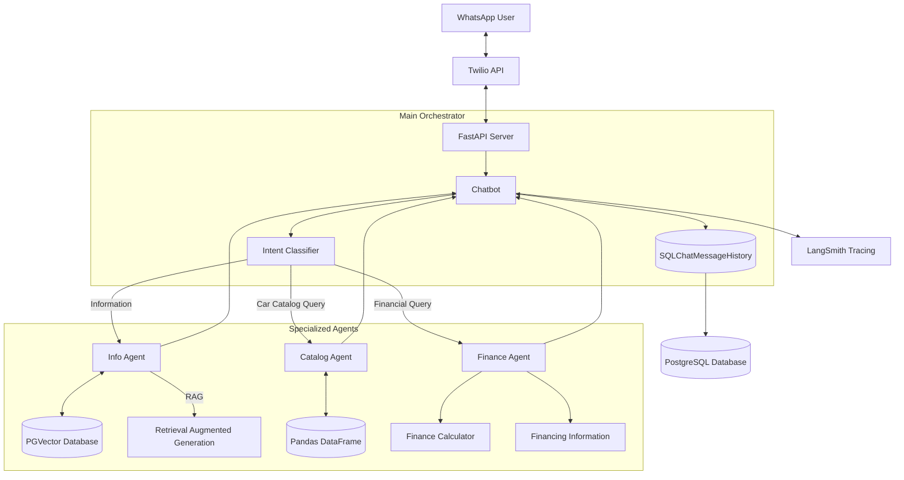
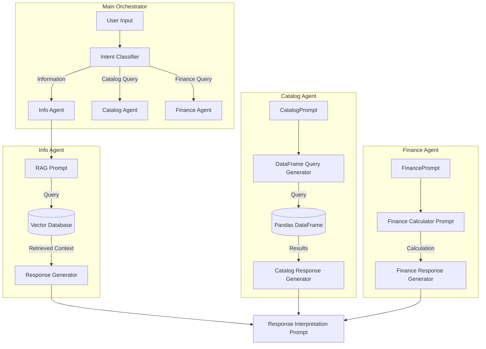
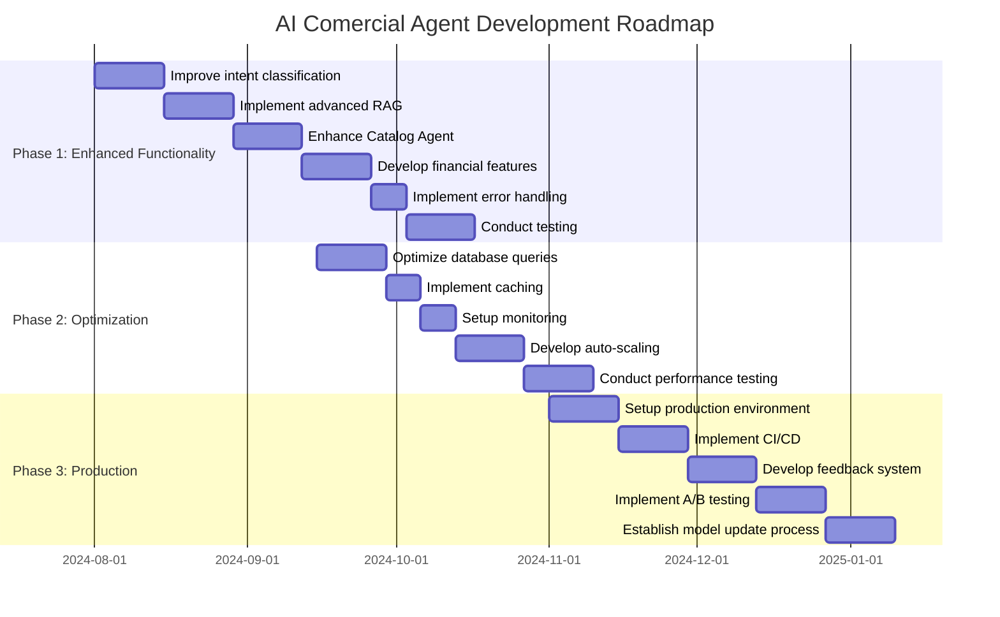

# AI Comercial Agent

## Table of Contents
1. [Introduction](#introduction)
2. [High-Level Architecture](#high-level-architecture)
3. [Prompt Architecture](#prompt-architecture)
4. [Roadmap and Backlog](#roadmap-and-backlog)
5. [Installation and Setup](#installation-and-setup)

## Introduction

The AI Comercial Agent is an advanced chatbot designed to simulate a commercial agent for Kavak, leveraging state-of-the-art language models and a modular architecture. This chatbot interacts with users via WhatsApp, providing information about Kavak, assisting with car catalog queries, and offering financial plans.

## High-Level Architecture



### Components Description:

1. **User Interface**: Users interact with the chatbot through WhatsApp, with Twilio acting as an intermediary to handle WhatsApp messages.

2. **FastAPI Server**: Receives requests from Twilio and passes them to the main orchestrator (Chatbot).

3. **Main Orchestrator (Chatbot)**:
   - Coordinates the entire conversation flow.
   - Uses SQLChatMessageHistory to maintain conversation context, stored in a PostgreSQL database.
   - Contains an intent classifier to determine which specialized agent should handle each query.

4. **Specialized Agents**:
   - **Info Agent**: Uses PGVector for storing and retrieving information about Kavak. Implements RAG for generating accurate responses.
   - **Catalog Agent**: Works with a Pandas DataFrame containing the car catalog. Can perform complex queries and analysis on the catalog.
   - **Finance Agent**: Includes a financial calculator to generate payment plans and accesses detailed information about financing options.

5. **Data Storage**: PostgreSQL is used for both SQLChatMessageHistory and PGVector, providing a unified storage solution.

## Prompt Architecture



This diagram illustrates the flow of prompts and data through the system:

1. The user input is first processed by the Intent Classifier.
2. Based on the classified intent, the appropriate agent and its corresponding prompt are selected.
3. Each agent has its own prompt structure:
   - The Info Agent uses a RAG prompt to query the vector database and generate responses.
   - The Catalog Agent generates DataFrame queries and formats the results.
   - The Finance Agent uses prompts to guide calculations and format financial information.
4. The final response is generated based on the output from the selected agent.

## Roadmap and Backlog

### Phase 0: MVP Development
1. Set up development environment and project structure
2. Implement basic FastAPI server with Twilio integration
3. Develop main orchestrator with basic intent classification
4. Create initial versions of specialized agents (Info, Catalog, Finance)
5. Implement basic conversation history using SQLChatMessageHistory
6. Set up PostgreSQL database for storage

### Phase 1: Enhanced Functionality and Testing
1. Improve intent classification
2. Implement advanced RAG for the Info Agent
3. Enhance Catalog Agent with more complex querying capabilities
4. Develop comprehensive financial calculation features for the Finance Agent
5. Implement robust error handling and fallback mechanisms
6. Conduct thorough unit and integration testing

### Phase 2: Optimization and Scalability
1. Optimize database queries and vector search algorithms
2. Implement caching mechanisms to improve response times
3. Set up monitoring and logging systems
4. Develop auto-scaling infrastructure for handling increased load
5. Conduct performance testing and optimization

### Phase 3: Production Deployment and Continuous Improvement
1. Set up production environment with necessary security measures
2. Implement CI/CD pipeline for automated testing and deployment
3. Develop a system for collecting user feedback and ratings
4. Implement A/B testing framework for comparing agent versions
5. Establish a process for regular model updates and retraining

### How to Deploy to Production
1. Set up a production-grade Kubernetes cluster for containerized deployment
2. Use a service mesh for advanced traffic management and security
3. Implement secret management using tools like HashiCorp Vault
4. Set up a robust logging and monitoring stack (e.g., ELK stack, Prometheus, Grafana)
5. Use a blue-green or canary deployment strategy for zero-downtime updates

### How to Evaluate Agent Performance
1. Implement conversation ratings (e.g., thumbs up/down) after each interaction
2. Use automated metrics such as task completion rate, response time, and conversation length
3. Conduct regular human evaluation of conversation samples
4. Analyze user engagement metrics (e.g., repeat usage, session duration)
5. Monitor business KPIs such as conversion rates and customer satisfaction scores

### How to Test New Agent Versions
1. Implement comprehensive unit and integration tests for all components
2. Use conversation simulation tools to generate synthetic conversations for testing
3. Conduct A/B tests with a subset of users to compare performance metrics
4. Implement automated regression testing to ensure no loss of existing functionality
5. Use techniques like backtesting on historical conversations to evaluate improvements

## Installation and Setup

To install and run the Kavak AI Sales Agent project, follow these steps:

### Development Setup using Docker Compose

1. **Clone the repository:**
   ```bash
   git clone https://github.com/miltonparedes/commercial-agent-bot.git
   cd commercial-agent-bot
   ```

2. **Create and configure the environment file:**
   ```bash
   cp .env.sample .env.local
   # Fill in the necessary environment variables (database credentials, API keys, etc.)
   ```

3. **Build and start the services:**
   ```bash
   docker-compose up --build
   # or
   just up
   ```

4. **Access the application:**
   - The FastAPI server will be running at `http://localhost:8000`
   - Ensure that the PostgreSQL database is up and running as well.

### Production Setup using Docker
### Production Setup using Kubernetes

1. **Prepare Kubernetes configuration files:**
   ```bash
   # Create Kubernetes manifest files (deployment.yaml, service.yaml, etc.)
   # Consider using Helm charts for managing configurations
   ```

2. **Set up CI/CD for automated deployment:**
   ```bash
   # Configure pipeline in Jenkins, GitLab CI, or GitHub Actions
   # Include steps to build Docker image, push to registry, and deploy to K8s
   ```

3. **Manage secrets in Kubernetes:**
   ```bash
   # Use Kubernetes Secrets or an external solution like HashiCorp Vault
   kubectl create secret generic commercial-agent-secrets --from-env-file=.env
   ```

4. **Deploy the application to Kubernetes:**
   ```bash
   kubectl apply -f k8s/
   # Or if using Helm:
   # helm install commercial-agent-bot ./helm-chart
   ```

5. **Access the application:**
   - The application will be available through the configured Kubernetes LoadBalancer or Ingress

By following these steps, you can deploy the AI Commercial Agent project in a scalable and robust production environment using Kubernetes.
